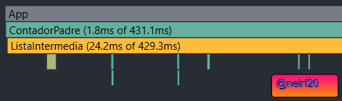

1. Demuestra con `console.log` que los 6 niveles se ejecutan en cada clic.

2. Abre React DevTools → Profiler → graba 5 clicks.

3. Muestra capturas de pantalla mostrando los tiempos de renderizado en cada clic.

4. ¿Se ve lento el navegador? ¿Cuántas funciones (`console.log`) se ejecutan en cada clic?
se ejecutan 8 console.log cada vez que das un click
5. ¿Son todos los renderizados necesarios? ¿Por qué?
No ya que se siguen repitiendo algunos que no deberian

6. **Modificar el programa para evitar los renderizados innecesarios.**
7. Vuelve a hacer los apartados 1 a 5.