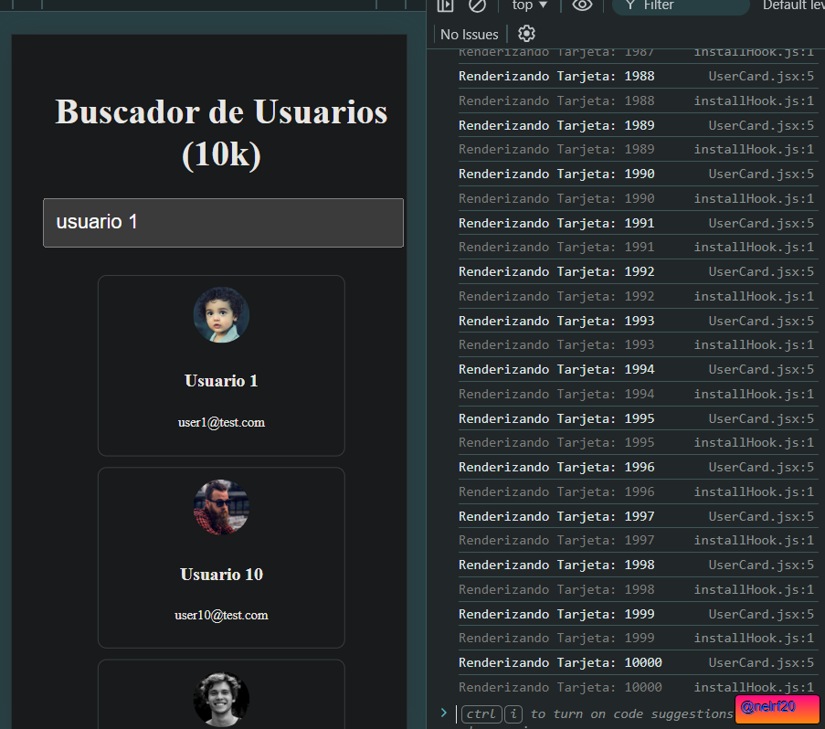

- Incluye capturas de pantalla de los resultados de `Profiles`.

- ¿A mejorado la velocidad de la aplicación? ¿qué cambios y por qué has hecho? Copia el código con ellos `README.md`
const UserCard = React.memo(({ user }) => { ... });
const UserList = React.memo(({ users }) => { ... });
const allUsers = useMemo(() => {
  return Array.from({ length: 10000 }, ...);
}, []); // 
const filteredUsers = useMemo(() => {
  return allUsers.filter(...);
}, [search, allUsers]); 