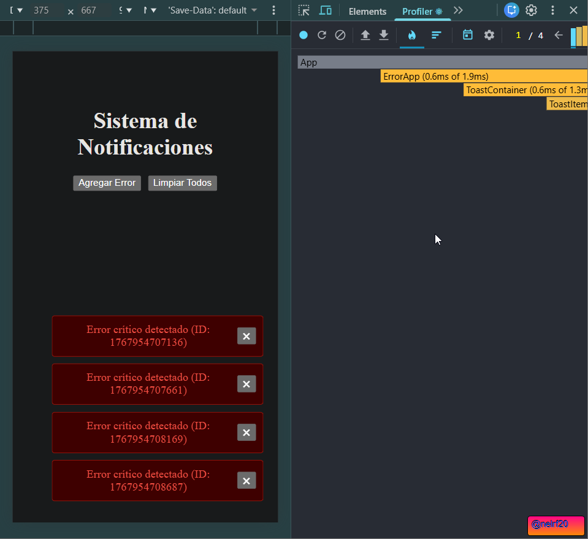
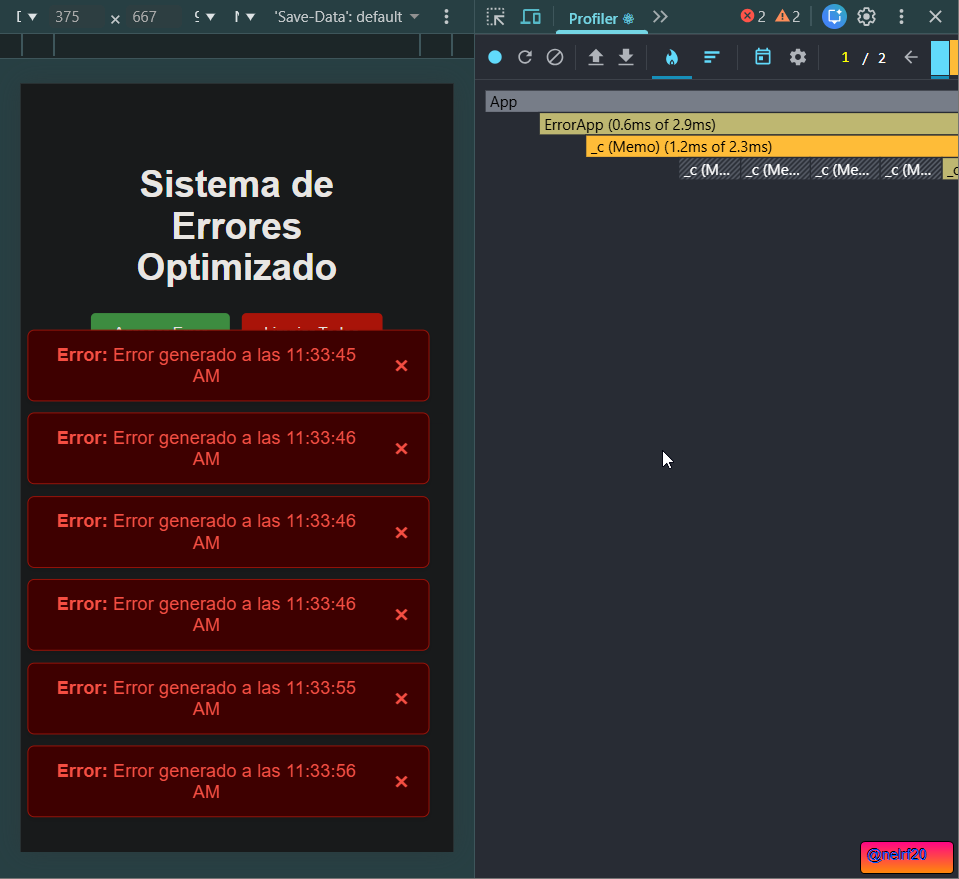

useCallback en clearError Las funciones en JavaScript son objetos Si no usas useCallback la funcion se crea de nuevo en cada clic lo que React interpreta como un cambio de datos. Al usarlo la funcion mantiene la misma referencia en memoria permitiendo que los hijos no se confundan.

React.memo en ToastItem Por defecto un hijo se re-renderiza siempre que su padre lo hace Al envolverlo en memo le decimos a React Solo vuelve a dibujar este Toast si su contenido o su funcion de cerrar realmente han cambiado